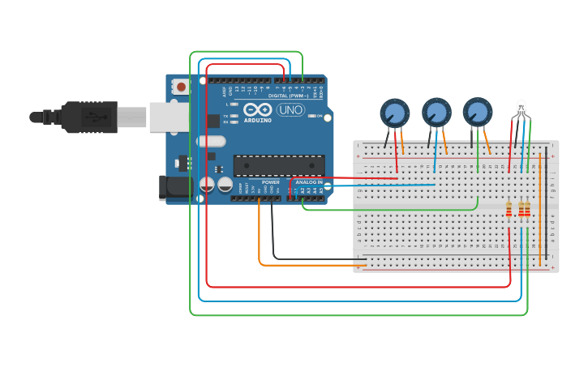

## 3.- Potenciometros y led RGB
Tres potenciometros controlan los colores rojo, verde y azul de un led RGB

#### Componentes
* 1	Arduino Uno R3
* 1	LED RGB
* 3	250 kOhm, Potentiometer
* 3	220 ohm Resistor

#### Circuito

#### Código
[Ver código](codigo.ino)
