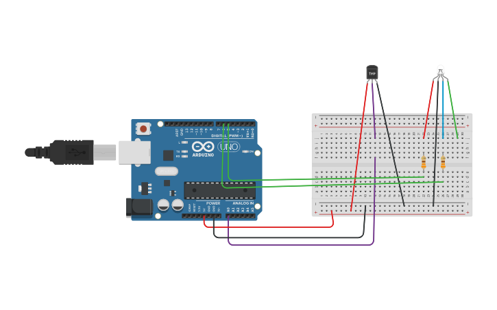

## 4.- Sensor de temperatura con led RGB
Según la temperatura del sensor el led RGB se muestra rojo si la temperatura es
alta y azul si es baja

#### Componentes
1	Arduino Uno R3
1	Temperature Sensor [TMP36]
1	LED RGB
2	330 ohm Resistor

#### Circuito

#### Código
[Ver código](codigo.ino)
