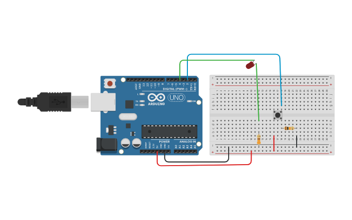

# Proyecto 1: Botón y led
Pulsa el botón y se enciende el led y vuelves a pulsar y se apaga
En la primera versión, se controla el rebote con un delay de 20 mlseg y 
en la segunda con una función antirebote.

#### Componentes
* 1	Arduino Uno R3
* 1	Pushbutton
* 1	330 ohm Resistor
* 1	Red LED
* 1	10 kohm Resistor

#### Circuito

#### Código

- [Ver código (v1)](codigo.ino)

- [Ver código (v2)](codigo2.ino)