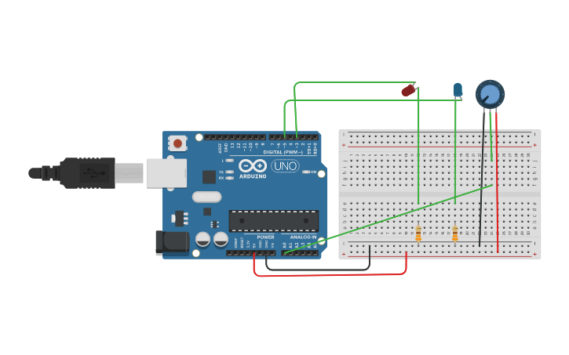

## 2.- Potenciometro y led
Incluye dos proyectos y fade-in y fade-out de un led y
otro led controlado por el potenciometro

#### Componentes
* 1	Arduino Uno R3
* 2	330 ohm Resistor
* 1	Red LED
* 1	250 kOhm, Potentiometer
* 1	Blue LED

#### Circuito

#### Código
[Ver código](codigo.ino)
