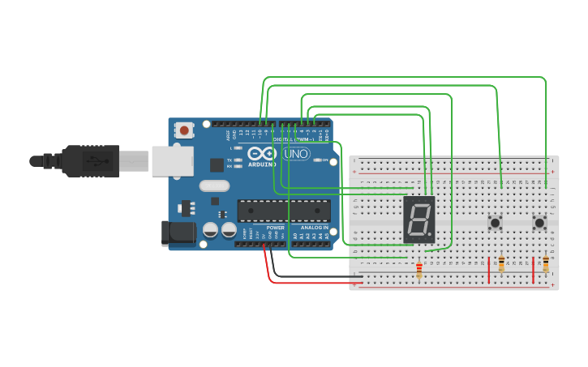

# Proyecto 5: Display 7 Segmentos
Display 7 segmentos de anodo común con botones para incremento y decremento

#### Especificaciones

#### Componentes
* 1	Arduino Uno R3
* 1	7 Segment Display
* 2	Pushbutton
* 1 220 ohm Resistor
* 2	10 kohm Resistor

#### Circuito

#### Código
[Ver código](codigo.ino)
