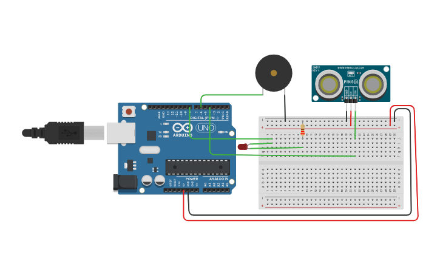

# Proyecto 6: Sensor Ultrasónico
Sensor ultrasónico con un zumbador y un led que funcionan cuando el sensor
detecta un objeto a menos de 100cm, incrementando el parpadeo y el zumbido 
cuando se reduce la distancia.

#### Componentes
* 1	Arduino Uno R3
* 1	Piezo
* 1	Ultrasonic Distance Sensor
* 1	Red LED
* 1	220 ohm Resistor

#### Circuito

#### Código
[Ver código](codigo.ino)
