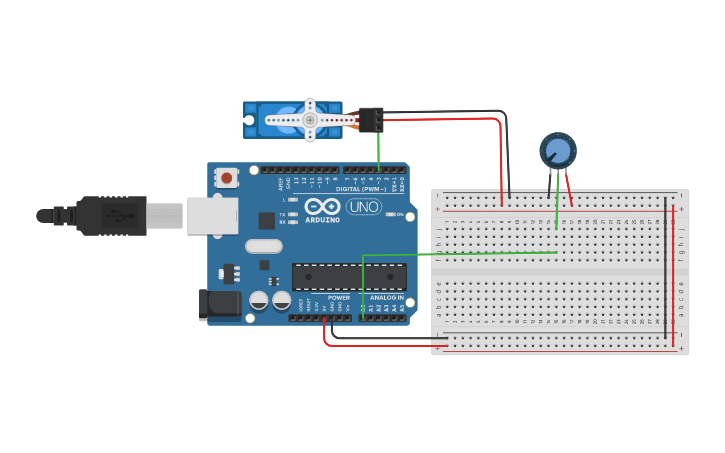

# Proyecto 7: ServoMotor
Servomotor controlado por un potenciometro.

#### Componentes
* 1	Arduino Uno R3
* 1	250 kOhm, Potentiometer
* 1	Micro Servo

#### Circuito

#### Código
[Ver código](codigo.ino)
